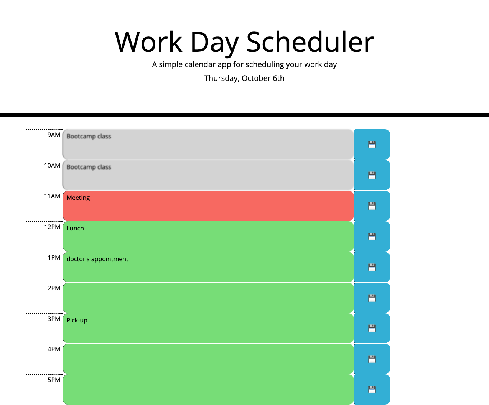

# Work Day Scheduler

Create a simple hourly calendar that allows a user to save events for each hour of the day by modifying starter code. Apply HTML, CSS, Bootstrap, Moment.js and Jquery to this application

## Acceptance Criteria

* The current day is displayed at the top of the calendar using moment.js
* I am presented with timeblocks for standard business hours(9am-5pm).
* Each timeblock is color changed whether it is in the past, present, or future.
* I can add an event and save it to local storage by clicking save button.
* When I refresh the page, the saved events persist.

## Mock-up
The following animation demonstrates the application functionality:

## Deployed git-hub
https://rogseo.github.io/workDayScheduler/

